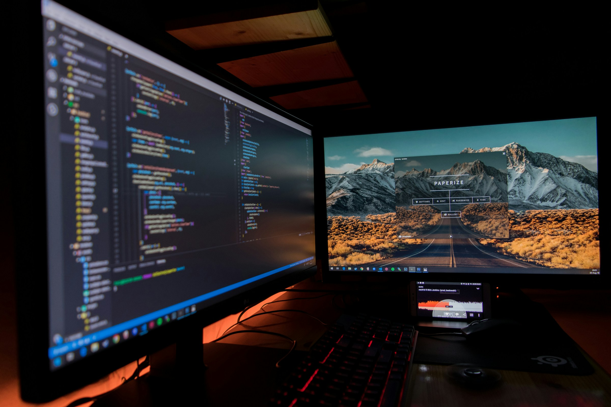
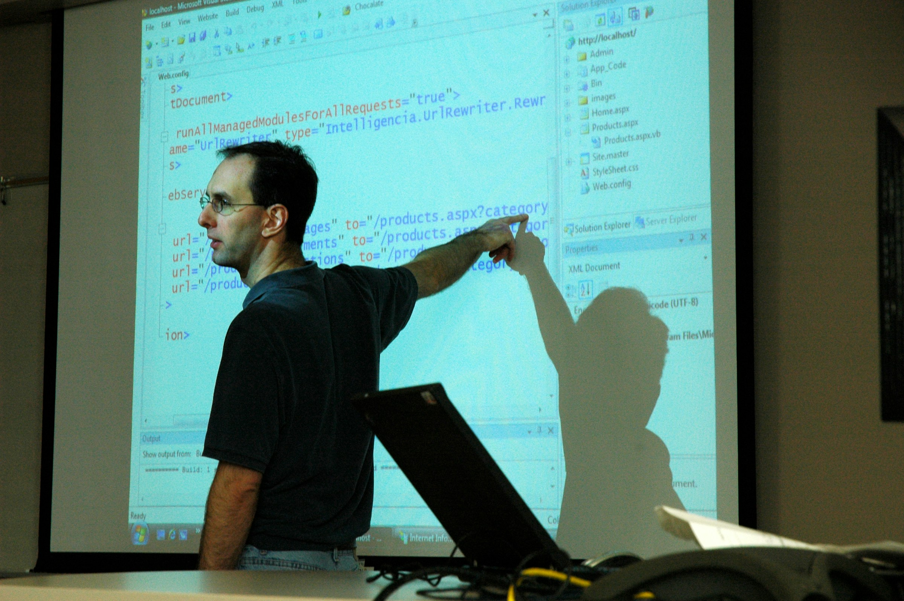

# Timelink - Final presentation/Demo

Presented by **LAMTCo Solutions**

<!-- Andre -->

---

# Project status update

## Status

- First version fully developed

<!-- Andre -->

---

## Some metrics

**Milestone**     | **Planned man-days**  | **Actual man-days spent**
-----------   | ----------------- | ----------------------
**1 (SPEC)**     | 7                 | 5
**2 (Design)**    | 7                 | 3
**3 (Back-end)** | 14                | 21
**4 (Mobile-app)**| 14                | 22
**5 (Admin-app)** | 14                | /
**6 (Testing)**   | 14                | 18

<!-- Elvin -->

---

# Updated scope

- **:white_check_mark: Completed**
    - Build the mobile app with all the essential functionalities
    - Build the Data Server completely with all basic functionalities for both Admin and Normal users

- **:x: Left-out for the first version**
    - Build a simple Admin page

<!-- Elvin -->

---

# Test Report

<!-- Manon -->

---

## Manual tests

- 12 manual test have been defined and tested

- **:white_check_mark:** 9 tests did pass with no issues what so ever

- **:x: 3 tess did unfortunately not pass**
    - 2 are related to reminder notifications
    - 1 is related with offline shift submitting

<!-- Manon -->

---

## Unit tests

- During the execution of the unit tests, several issues were discovered
  - mostly related to incorrect business logic in the backend layer 
- These issues demonstrate the usefulness of unit tests

- Most modules passed unit tests successfully, including:
  -  Service layer
  - Domain and DTO objects
  - Exception handling
  - Security configuration

<!-- Manon -->

---

### Percentage of tests that passed/failed
| **Test class** | **Number of tests executed** | **Passed** | **Failed** |
|:--------------:|--------------------------|:----------:|:----------:|
| Services       | 45                       | 44         | 1          |
| Controllers    | 19                       | 19          | 0          |
| Domain/Models  | 10                       | 10         | 0          |
| DTO            | 11                       | 11         | 0          |
| Exceptions     | 6                        | 6          | 0          |
| Security       | 22                       | 22         | 0          |
| Total          | 113                      | 112         | 1          |

<!-- Manon -->

---

# Time for the demo

<!-- Leonardo -->

---

# Final Conclusion

<!-- Andre -->

---

## Project overview

- :briefcase: **Main project deliverables**
  1. Brainstorming Ideas
  2. Defining Specifications
  3. Software Architecture Design
  4. UI Mockups Design
  5. Blueprint
  6. Back-end Development
  7. Front-end Development

<!-- Tomas -->

---

## Results and highlights

- Prototype version 1 of Timelink (Proof of Concept)
- Solid base code for future extension:
  - Security
  - Back-end solution
  - Front-end solution

<!-- Andre -->

---

## Challenges and resolutions

- A good portion of the initial scope had to be cut-off to guarantee the implementation within the delay.
- How to structure the design to make sur it is compliant and feasible
- Learn new programming languages
- Lack of design definition

<!-- Andre -->

---

## Positive outcomes

- **Technical**
  - Expo and React Native
  - Swagger/OpenAPI Integration
  - React Native vs React
- **General**
  - I improved my ability to follow project tasks and manage my own contributions efficiently, such as keeping track of issues and handling data consistently.
  - My teamwork and collaboration skills developed further through coordinating with team members.

<!-- Tomas -->

---

## Lessons learned

- Design should be more emphasized
  - Meaning that it to should further specified
- Testing should have been started earlier
- Avoid scope creep, always count with things to go wrong

<!-- Andre -->

---

# Hope you enjoyed working with us
By **LAMTCo Solutions**

<!-- Andre -->
