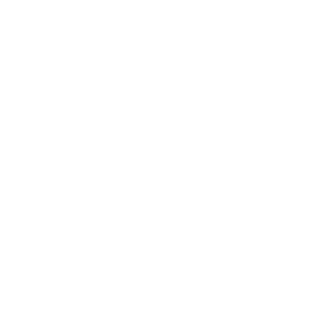

# Timelink
Presented by **LamCo Solutions**

---

## Project summary

- Easy way to for employees to mark their working hours.

- Usage of an mobile app

- Usage of a central Data Server

- Usage of an admin platform

---

## Project goals

- Simple User interface for the mobile app

- The mobile shall work offline 

- The administrator page with several graphs that will demonstrate all the admin needs in a easy and direct way

- All the other goals will be specified more specifically in the SPEC sheet

---

## Project Deliverables

- Documentation:
  - All the meeting will have their respective minute
  - Main project specification sheets
  - Manual tests

---

## Mobile app

- app where all users will be able to insert all their working hours

- Based on a **React-Native** platform

---

## Data server

- Springboot-based application

- respective SQL database

- This server will mainly serve as an API for both client and administrator platforms

---

## Administrator platform

- A non-mobile application, also **react-native**

- Goal of the app will be to show 

---

## Scope
**In Scope**
- [List items included]  

**Out of Scope**
- [List items excluded]  

---

## Benefits and Costs
**Benefits**  
- [Efficiency gains, savings, improvements]  

**Costs**  
- [Estimated resources, budget, time]  

---

## Key Dates & Milestones
- Kickoff: [date]  
- Milestone 1: [date]  
- Milestone 2: [date]  
- Delivery / Go-Live: [date]  

---

## Key Risks
- Risk 1 → Mitigation  
- Risk 2 → Mitigation  
- Risk 3 → Mitigation  

---

## Stakeholders & Team
- **Sponsor:** [name]  
- **Project Lead:** [name]  
- **Team Members:** [names/roles]  
- **Other Stakeholders:** [departments, partners]  

---

# Thank You
Questions?
