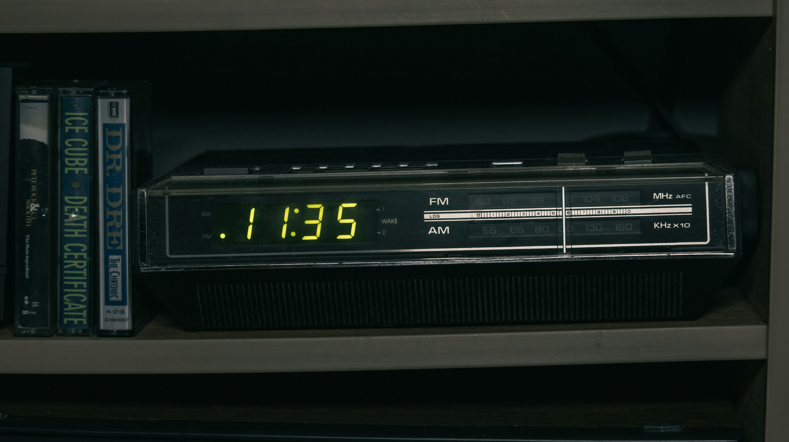
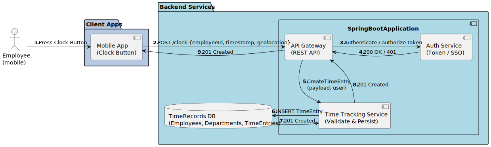
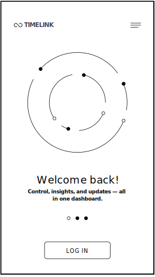

# Timelink - Specification

Presented by **LAMTCo Solutions**

<!-- Andre -->

---

# Overview

- Specification
- Main Design
- UI Concepts
- Identified Risks 

<!-- Andre -->

---

# Specification

## User Stories

  All the use cases have been implemented but will not be shown in the presentation

<!-- Andre -->

---

# Timelink mobile

  As a(n) Employee, I want to see a list of all my logged hours,  
  so that I can monitor attendance and verify shift compliance.

  As a(n) Employee, I want to start my shift by pressing a "Start Shift" button in the application, so that the system may begin logging my working hours accurately.

<!-- Leonardo -->

---

# Timelink mobile

  As a(n) Employee, I want to end my shift by pressing a "End Shift" button in the application, so that the system may log the end of my shift accurately.

  As a(n) Employee, I want to receive a notification if I forget to start or end my shift, so that I don't miss logging my hours.

<!-- Elvin -->

---

# Timelink desktop

  As an admin, I want to view employee working hours and their working locations, so that I can monitor attendance and manage work distribution.

  As an admin, I want to see visual representations of total working hours per location, so that I can easily analyze workload distribution.

<!-- Tomas -->

---

# Timelink desktop

  As an admin, I want to add and remove users from the system, so that I can manage access and maintain an up-to-date user list.

  As an admin, I want to filter employee data by department or project, so that I can analyze work distribution more efficiently.

<!-- Manon -->

---

# Timelink desktop

  As an admin, I want to edit an existing working place and assign employees to them, so that I can maintain an up-to-date organizational structure.

  As an admin, I want to view an activity log of recent changes in the system, so that I can track who modified what and when.

<!-- Andre -->

---

# Main components and data flow
 
- The architectural design has been defined in 4 different levels
- C1 - System level
- C2 - Container level
- C3 - Component level
- C4 - Code level

<!-- Andre -->

---

## C1 - System level

<!-- Andre 
The project consists on three main deliverables
- Database System -> The main brain of the system
- Timelink mobile -> Simple app where all users shall insert their working hours
- Timelink admin -> Administrator app for managers -->

---

## C2 - Container level

<!-- Andre 
Explain each component together with each communication protocol -->

---
## Tipical data workflows

### Admin platform

<!-- Elvin -->

---
## Typical data workflows

### Mobile platform

<!-- Elvin -->

---
# UI designs/mockups

## Timelink admin

<!-- Tomas -->

---

# Timelink admin

### Welcome page

  Some visual elements could undergo some changes

<!-- Tomas -->

---

# Timelink admin

### Sign in page

<!-- Tomas -->

---

# Timelink admin

### Application dashboard

<!-- Tomas -->

---

# Timelink admin

And some other pages...

<!-- Tomas -->

---

<!-- Tomas -->

---

# UI designs/mockups

## Timelink mobile

<!-- Leonardo -->

---

# Timelink mobile

Shift history diagram

<!-- Leonardo -->

---

# Timelink mobile

Employee punch-in procedure

<!-- Leonardo -->

---

/01.svg)
/02.svg)
/03.svg)

<!-- Leonardo -->

---

# Timelink mobile

/01.svg)
/02.svg)

Employee punch-out procedure

<!-- Leonardo -->

---

# Risk management

<!-- Manon -->
---

# Identified risks

  Regulatory non-compliance (GDPR)

  Inconsistency between logs and actual actions

  Data privacy violations

<!-- Manon
- Regulatory non-compliance (GDPR); No compliant measures (hashing, session timeout); High, legal risk, reputation risk
- Inconsistency between logs and actual actions;The logs do not accurately reflect the changes (delay or recording error).High -->

---

# Current state of the project

## What has been done

*Milestone 1 and 2 accomplished*

  <li> The project specification has been defined
  <li> All the architecture has been defined at the container level
  <li> Some major risks have been identified 

---

# Current state of the project

## Our next steps

*Start of Milestones 3,4 and 5*

  <li> The development will start soon
  <li> We plan to define the design at the class level together dynamically
  <li> Start risk mitigation for the current identified risks

