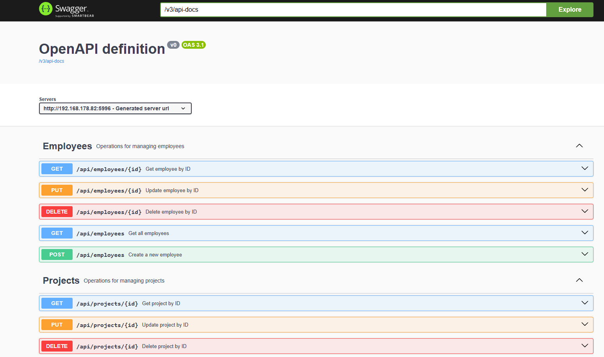
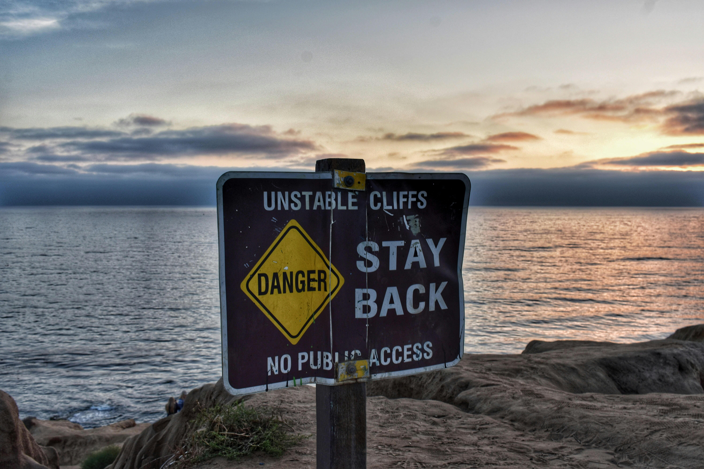
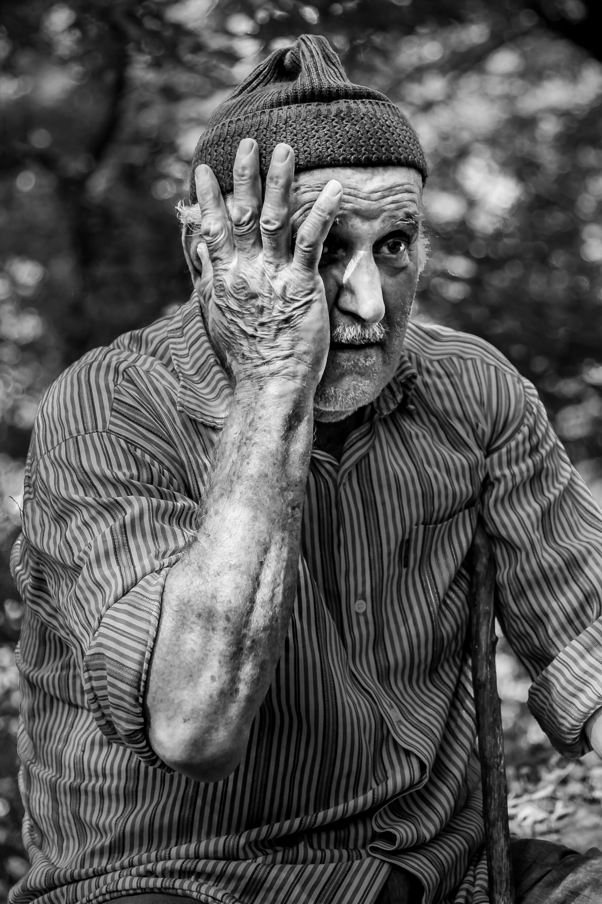

# Timelink - Development

Presented by **LAMTCo Solutions**

<!-- Andre -->

---

# Backend development

## Status

- First version fully developed

- First API/Data server fully running

---

## What main methods have been developed

- The api is currently running a swagger api specification tool that helps understand what the API does

---

# Manual Test cases

- Most of the manual test cases have been implemented for the current scope

---

# Some examples

## Start a shift UC-2

- **Preconditions:**
    -  User connected
    -  Application has GPS allowed (optional)
- **Steps:**
    -  Open application
    -  Go to the shift page 
    -  Click button “Start shift”

- **Expected Result:**
    - Shift has started within 2 seconds
    - Timestamps and GPS saved
    - Message “Shift started at hh:mm”

---

## And there are many more

- There are around 12 Manual tests for the current project scope 

---

# Project status

---

    - Back-end has been completely developed 
    - All the manual tests have been implemented 
    - Both front-end as well as well unitary testing have started as well

    - First version of the front-end 
    - All the unit tests and integration tests finished as well 
    - Preparing the final demo as well as the final presentation

